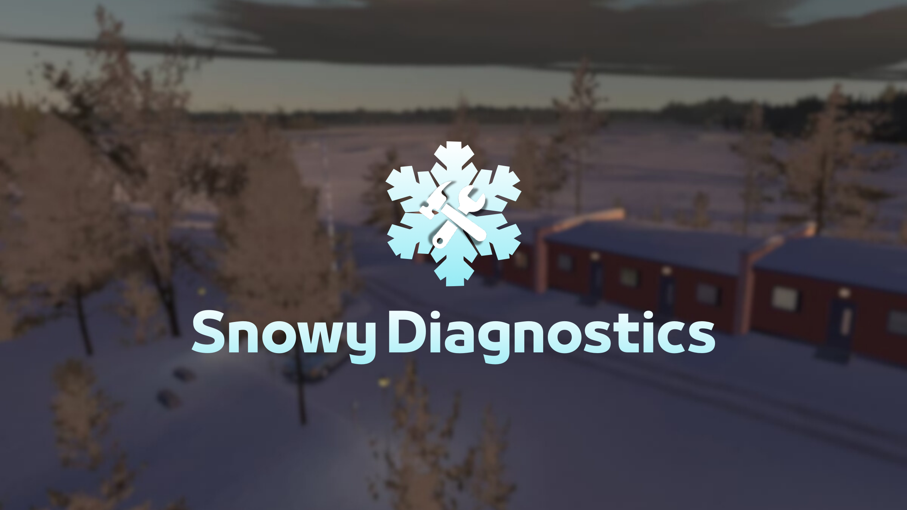
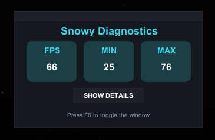
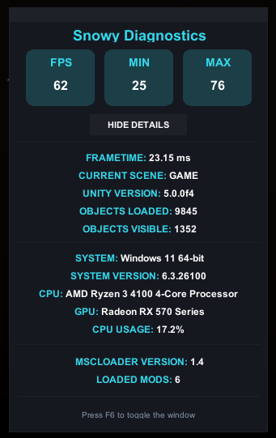

  

  <strong>Snowy Diagnostics</strong> is a lightweight mod for <em>My Winter Car</em> that displays performce data in real-time. Perfect for game debugging and tracking performace issues.

---

<h1 align="center">Features</h2>

⚡ <b>Performance friendly</b> – I tried my best to keep it light 
🎮 <b>Shows Current/Min/Max FPS</b> – Always know your frame performance 
📊 <b>Shows your current framerate</b> – Keep track of smoothness in real time 
🗺️ <b>Shows currently loaded scene</b> – Know which scene of the game is active 
🧩 <b>Shows amount of loaded objects</b> – See how many objects are in the scene 
👀 <b>Shows objects you are currently looking at</b> – Track what’s in your view 
👆 <b>Ability to drag the menu window</b> – Move it anywhere on screen 
✨ <b>And much more...</b> – Extra features to explore

---

<h1 align="center">Installation</h2>

<strong>You have two ways to install the mod. You can do it through Nexus Mods:</strong>

  

<strong>Or you can do it here, through GitHub:</strong>

1. Download the latest version from <a href="https://github.com/xAwakenDeveloper/Snowy-Diagnostics/releases">Release</a>.   
2. Install <a href="https://github.com/piotrulos/MSCModLoader">MSCLoader (For My Winter Car)</a>.   
3. Extract the files into your mods folder.   
4. Launch the game and enjoy the mod!

---

<h1 align="center">Preview</h2>

<strong>Here's a preview of less detailed mode:</strong>

  

<strong>And here's a preview of more detailed mode:</strong>

  

---

<h1 align="center">Usage & Restrictions</h2>

No restrictions, you are free to use, modify or distribute this mod!

---
